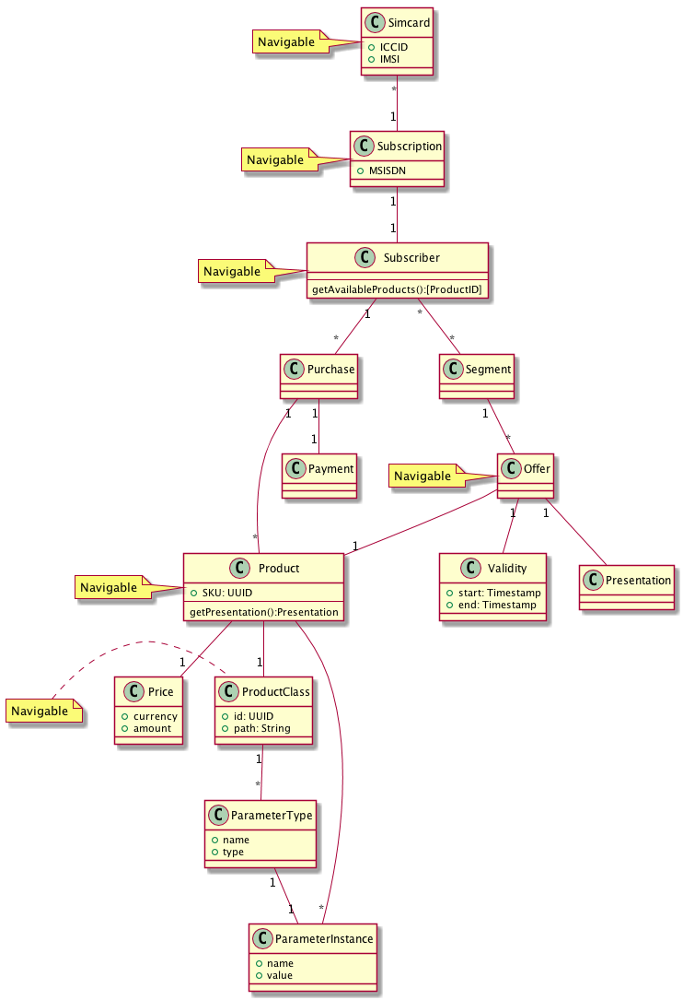

# Domain model

This description of the domain model is based on UML, and should be
merged with and be treated as a step towards implementation of the
text-based domain model:

The diagram should be interpreted like this:

* The classes may or may not be implemented as java/kotlin classes, they may
  equally well be interfaces
* The classes marked as "navigable" are intended to have a namespace
  that makes it possible to address them using their unique names, using
  a REST like syntax.  So for instance to find  a subscriber's simcards,
  on could do:

      GET /subscriber/id/{id}/msisdn/simcard

  ... where {id} is the ID of the subscriber.
