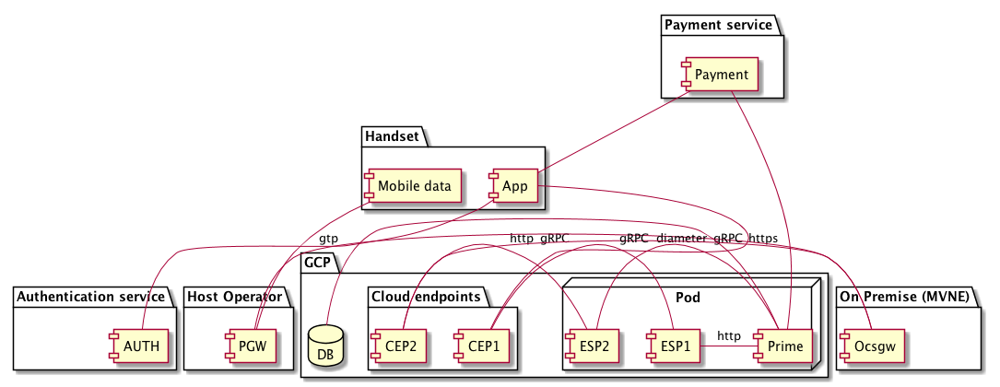

# Domain model

This description of the domain model is based on UML, and should be
merged with and be treated as a step towards implementation of the
text-based domain model:

The diagram should be interpreted like this:

* The handset contains a self service app, and a mobile data stack.
* The self service app talks to a payment provider to pay for purchases.
  The payment provider talks to the Prime application to confirm that
  payment has taken place.
* The mobile data stack talks to the packet gateway of the host operator
* The self service app talks to the "prime" component to facilitate
   purchases and status updates.  It does so via a cloud endpoint, that
   terminates HTTPS connections, and sends an authenticated http
   connections to the Extensible Service Proxy (ESP) which runs
   as a sidecar in the same pod as the Prime component
* On the premises of the mobile network enabler (MVNE) we run
  an "ocsgw", "online charging server gateway", that implements the
  ambassador pattern for an OCS.
* The ocsgw connects to  the "prime" component via a cloud endpoint
   and an ESP, but does so using a service certificate-authenticated
   gRPC connecdtion
* The Prime component connects to a GCP provided database for persistent
  storage