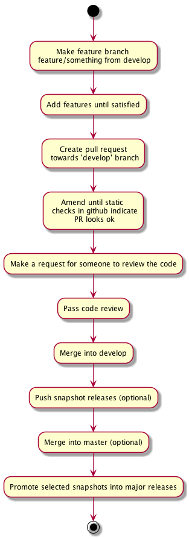

#  Describe the workflow to generate both artefacts for distribution through maven central

We use a variation of the ["gitflow"](https://www.atlassian.com/git/tutorials/comparing-workflows/gitflow-workflow) workflow, where all work is done in feature branches,  which are merged into the "develop" branch.   Snapshot releases are done from the "develop" branch.  The master branch only ever gets merges from the develop branch, and major releases (non-snapshot) are done from the master branch.

At this time releases to maven central must be done on a developer workstation, since we don't have build servers that are trusted to hold the certificates necessary to do the releases

#Before you can release to maven central

At this time we have one library in the repository, the diameter-stack.

To deploy to maven central we use the sonatype repository, as described [here](http://central.sonatype.org/pages/ossrh-guide.html).

To make this work follow instructions in http://central.sonatype.org/pages/working-with-pgp-signatures.html to create a PGP signature for publishing artefacts with.

The instructions will fail however, since the gradle plugin currently is reading from a "secring", no matter what you type in the gradle.properties file.  You will therefore have to create a secring, containing the required key(s):

     gpg --export-secret-keys >~/.gnupg/secring.gpg
     

# Releasing to maven central

* Edit the  version inside build.gradle to whatever the next version is
* If releasing a snapshot version, then from the develop branch run:
     
     
         gradle uploadArchives
         
  For snapshot releases, that's all there is to it. It will now be propagated to Maven Central.
    
* If releasing a major version, then run the uploadArchives command from the master branch.   Relax, watch the blinking lights, and then follow instructions in http://central.sonatype.org/pages/releasing-the-deployment.html to manually release the library to maven central.
